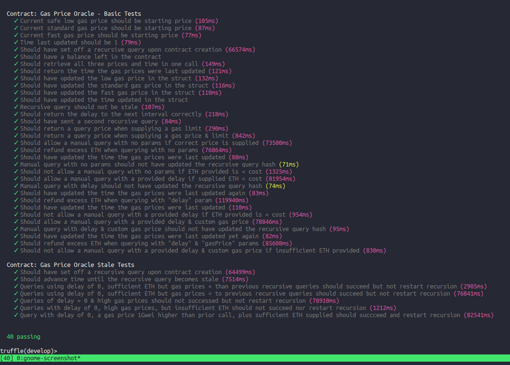

# __A Gas Price Oracle leveraging Oraclize__
&nbsp;

## :computer: __What this is:__

Designed for the ethereum community, this is an Oraclize-powered and Oraclize-funded ethereum gas-price oracle for providing ate on-chain gas prices. The smart-contract allows anyone to query the EthGasStation.info for up-to-date gas prices at any time - other smart-contracts can make queries too! In addition, an ongoing recursive query funded by Oraclize will ensure the latest gas prices are updated in the contract every six hours - enjoy!

&nbsp;

---

&nbsp;

### :fuelpump: __Gas Prices__: 

**❍** Requires ~ 3,600,000 gas for deployment.

**❍** Gas for normal query to gas station is ~ 111,000.

**❍** Gas for restarting the recursive chain is ~~170,000~~ 111,000 too now.

**❍** _Recursive_ callbacks cost ~170409 so limit is 171000.

**❍** _Non recursive_ callbacks cost ~ 85,350 so their limit is set at 87,000.

**❍** Recursive restarting queries also refund excess ETH, meaning if the recursions stopped due to insufficient ETH balance, it should be topped up first.

&nbsp;

***

&nbsp;

### :mortar_board: __Instructions to test:__

**Pre-flight.** Make sure you have Truffle 5 installed globally: 

**`❍ npm install -g truffle@beta`**

**1.** Clone the ethereum-examples repo:

**`❍ git clone https://github.com/oraclize/ethereum-examples.git`**

**2.** Switch into the gas-price-oracle directory:

**`❍ cd ethereum-examples/solidity/gas-price-oracle`**

**3.** Install dependencies:

**`❍ npm install`**

**4.** Start Truffle via:

**`❍ truffle develop`**

**5.** Start the Ethereum bridge in a new console via:

**`❍ npm run bridge`**

**6.** Once bridge is spooled up, back to first console to run the tests via:

**`❍ truffle_develop> test`**