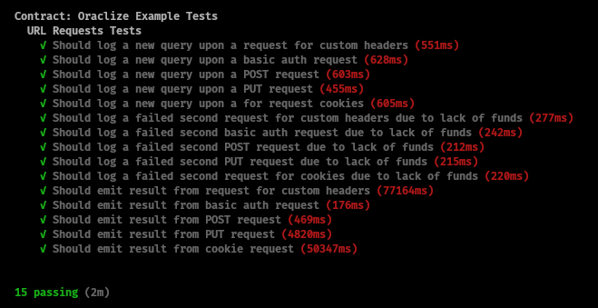

# :wrench: :construction: Testing Provable's Url-Requests Example.

&nbsp;

This repo is to demonstrate how you would set up a Provable smart-contract development environment using Truffle & the Ethereum-Bridge to do most of the heavy lifting for you. Head on over to the `./test` folder to examine the javascript files that thoroughly test the smart-contract, which latter you will find in `./contracts`.

## :page_with_curl:  _Instructions_

**1)** Fire up your favourite console & clone this repo somewhere:

__`❍ git clone https://github.com/provable-things/ethereum-examples.git`__

**2)** Enter this directory & install dependencies:

__`❍ cd ethereum-examples/solidity/truffle-examples/url-requests && npm install`__

**3)** Launch Truffle:

__`❍ npx truffle develop`__

**4)** Open a _new_ console in the same directory & spool up the ethereum-bridge:

__`❍ npx ethereum-bridge -a 9 -H 127.0.0.1 -p 9545 --dev`__

**5)** Once the bridge is ready & listening, go back to the first console with Truffle running & set the tests going!

__`❍ truffle(develop)> test`__

&nbsp;

## :camera: Passing Tests:

&nbsp;

## :black_nib: Notes:

__❍__ The computation data-source combined with the ethereum-bridge in a development environment can make for a slightly slower than usual response time for the Provable `__callback` - please be patient whilst this occurs!

__❍__ Note also that the `UrlRequests.sol` smart-contract in `./contracts` has the proof-type commented out in the constructor. This is because the TLS-Notary proof has been disabled on test-nets due to abuse. Using Oraclize on the ethereum main-net _without_ proofs however is _not_ recommended, so don't forget to re-enable them for live deployments!

__❍__ If you have any further issues, head on over to our [Gitter](https://gitter.im/provable/ethereum-api?raw=true) channel to get timely support!

__*Happy developing!*__
